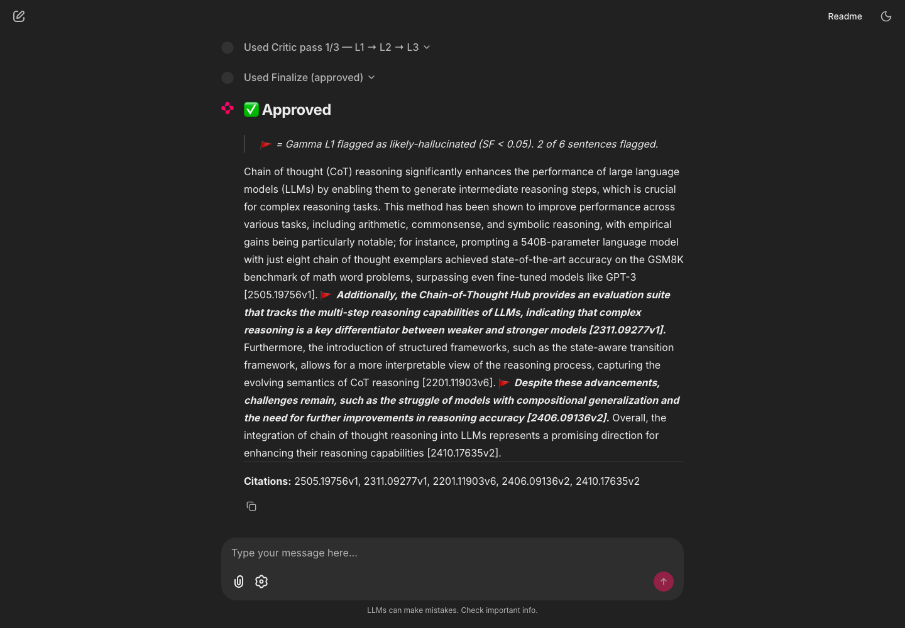
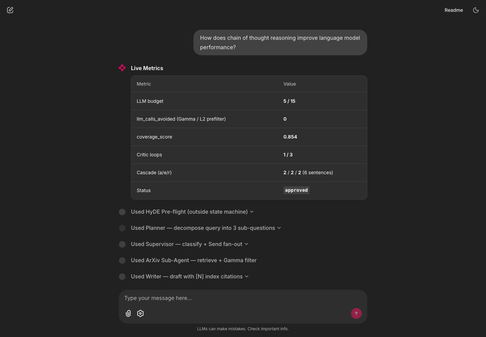
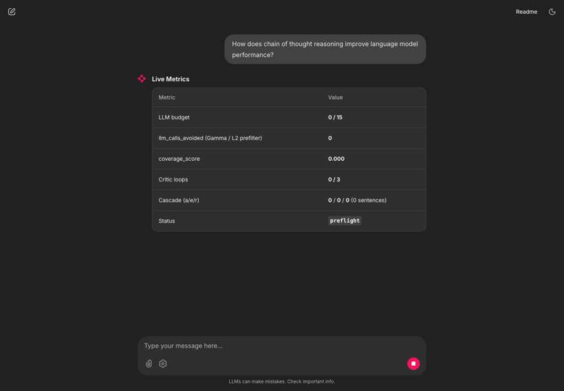
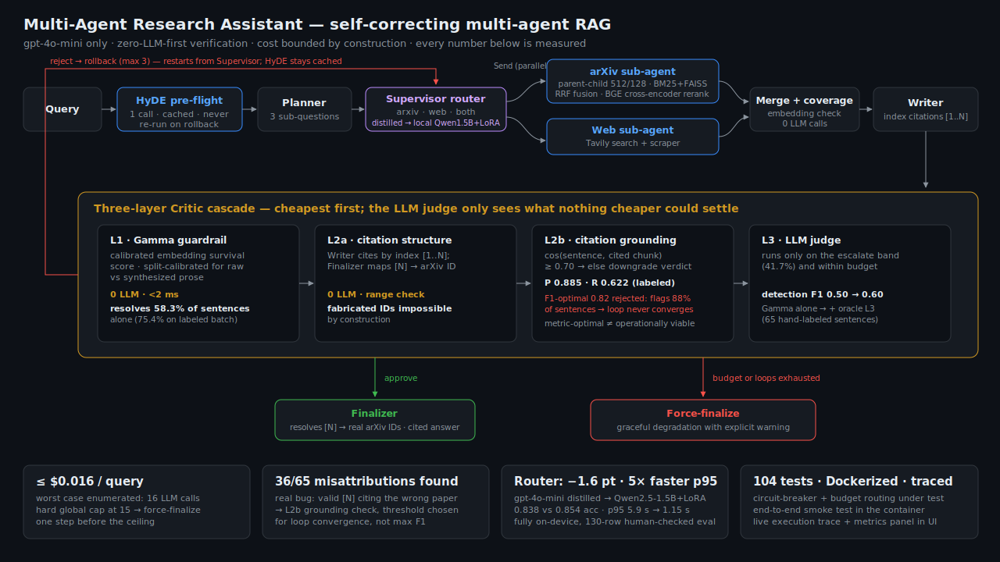
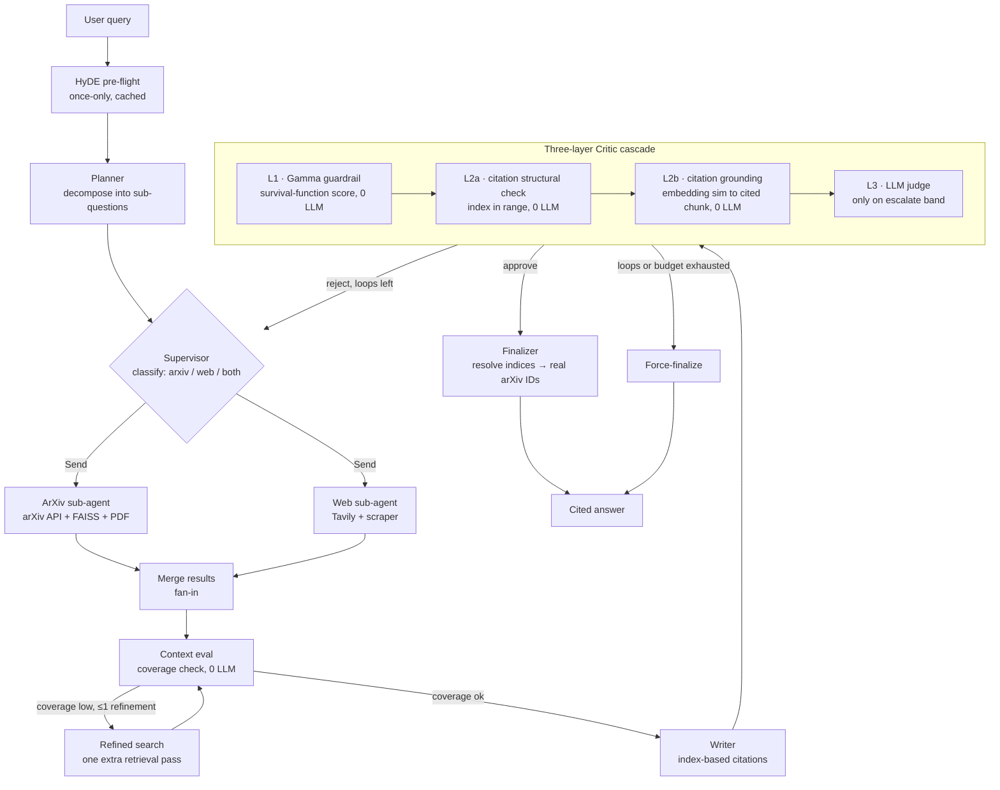

# Academic Research Agent — Multi-Agent Self-Correcting Research System


A production-minded research assistant that answers academic questions by
retrieving across arXiv + the web, drafting a cited synthesis, and
**self-correcting** through a three-layer verification cascade that keeps
LLM cost bounded by construction.

Built end-to-end on an M5 Pro with `gpt-4o-mini` as the only LLM — no model
upgrades, no managed vector DB, no framework black boxes. The interesting
engineering is in the parts most demos skip: parallel multi-agent retrieval,
a cheap-first hallucination cascade, and a hard global budget cap.

> **Author:** Yuezhou Zhao · Independent Research

---

## TL;DR — what makes this more than a LangGraph tutorial

| Challenge most demos ignore | What this system does |
|---|---|
| Retrieval precision vs. generation context | **Native parent-child chunking** — 50 lines of hand-written Python, 128-token children for recall, 512-token parents for context |
| Hallucination detection without a slow LLM judge | **Three-layer cascade**: calibrated embedding guardrail (0 LLM, <2 ms) → citation grounding (0 LLM) → LLM judge only on the uncertain middle band |
| "Multi-agent" that's really sequential nodes | **True parallel** arXiv + web sub-agents via LangGraph `Send`, independent tool sets, no shared intermediate state |
| Cost spiral in nested correction loops | **Global LLM budget cap (max 15 calls/query)** with documented worst-case math — ~$0.016/query ceiling |
| Paying an API for a routing gate on every query | **Distilled the router into a local Qwen2.5-1.5B + LoRA** — within 1.6 pts of gpt-4o-mini accuracy at ~3–5× lower latency, on-device ([details](#local-inference-extension--distilling-the-router-with-lora)) |

---

## See it run



*A real query end-to-end: the Critic approves after one visible rollback; 🚩
marks the sentences Gamma's L1 flagged as likely-hallucinated (2 of 6 in this
run), and the Writer's `[N]` index citations arrive resolved to real arXiv
IDs by the Finalizer.*

<details>
<summary>Live metrics panel + execution trace, and the whole run animated</summary>





</details>

---

## Engineering-judgment highlight — when the metric-optimal number broke the live system

The single decision I'd most want to walk through:

The citation-grounding check (L2b) has a similarity threshold. Swept against
my human-labeled set, **0.82 was F1-optimal** (recall 0.97, F1 0.89) — the
number the metric told me to ship. It was **operationally unviable**: 0.82
sits *above* the correct-citation similarity mean (0.779), so it flagged
~88% of all sentences, the self-correcting loop never converged, and nearly
every query **force-finalized — non-deterministically** (same query approved
on one run, force-finalized the next).

**My own dry-run harness caught it, not the labeled metric.** I then swept the
detection-vs-operability tradeoff explicitly (added a `%flag` column for "how
much of a real draft gets downgraded") and deliberately shipped **0.70** —
fewer misattributions caught (62% vs 97%), but a loop that actually converges.

Found the metric-optimal number → discovered it doesn't survive contact with
the live system → measured the real tradeoff → chose deliberately for
operational stability, not pure F1. Full arc in
[Section 4.9 of the design doc](agent_system_design_v2.md) and the sweep in
[`experiments/results/threshold_validation.md`](experiments/results/threshold_validation.md);
the harness that caught it is [`scripts/demo_dryrun.py`](scripts/demo_dryrun.py).

---

## Architecture



<details>
<summary>Text version of the flow (mermaid)</summary>



</details>

**Hybrid architecture, stated precisely:**

- **Retrieval tier — genuinely multi-agent.** The `ArXivResearchAgent` and
  `WebResearchAgent` own independent tool sets and run concurrently via
  LangGraph's `Send` API. The Supervisor classifies each query and dispatches
  one or both; results merge only at a fan-in node. Independent tools,
  parallel execution, no shared intermediate state — the strict definition.
  ("Parallel" stated precisely: async-concurrent within one process/event
  loop — the independence is about tool sets and state, not distributed
  infrastructure.)
- **Synthesis tier — multi-role state machine.** Planner, Writer, and Critic
  share `AcademicResearchState` on purpose: their data dependencies are tight
  (Writer needs the Planner's sub-questions; Critic needs the Writer's draft).
  Forcing them into separate agents would add message-serialization overhead
  for no benefit.

---

## The self-correcting cascade (the core idea)

Every sentence in a draft is scored cheapest-first. Only genuinely uncertain
sentences ever reach an LLM.

1. **L1 — Gamma guardrail** (`evaluation/gamma_guardrail.py`). A calibrated
   embedding-distance survival-function score, ~2 ms, zero LLM calls.
   Split-calibrated: one profile for raw arXiv abstracts, a separate one for
   synthesized Writer prose (they occupy different distributions). Resolves
   the confident-approve and confident-reject bands outright.
2. **L2a — citation structural check** (`evaluation/citation_check.py`). The
   Writer emits *index-based* citations `[1..N]`; the Finalizer resolves them
   to real arXiv IDs. This makes a fabricated identifier impossible by
   construction — an index is either in range or it isn't.
3. **L2b — citation grounding** (`evaluation/citation_grounding.py`). L2a
   proves the citation points at a *real* paper; L2b checks it points at the
   *right* one. For each cited sentence it computes
   `cosine(encode(sentence), centroid(encode(cited_chunks)))` and downgrades
   the cascade decision one step if the sentence isn't actually supported by
   its cited chunk. Zero LLM calls. (See "Citation misattribution" below —
   this layer exists because of a real bug found during evaluation.)
4. **L3 — LLM judge**. Runs only on the `escalate` band that L1/L2 couldn't
   resolve, and only while the global budget allows.

**Loop control is bounded on three axes:** outer circuit breaker
(Critic→Researcher, max 3) + inner active refinement (max 1) + global LLM
budget (max 15). Worst-case call count is enumerated in the design doc; the
budget cap forces a finalize one step before the theoretical ceiling.

---

## Quantitative results

### HyDE A/B — a negative result, reported honestly (n = 10 queries)

Each query run twice — HyDE off vs. on — everything else fixed.

|                    | HyDE off | HyDE on |
|--------------------|:--------:|:-------:|
| mean rollbacks     |   1.40   |   1.20  |
| mean chunk SF      |   0.643  |  0.643  |
| mean rerank score  |   2.313  |  2.361  |
| approved / n       |   9/10   |  9/10   |

**HyDE did not measurably help on this corpus.** Retrieval-quality metrics
(rerank score, chunk survival-function) are flat across 8 of 10 queries, and
the entire aggregate rollback improvement (1.40 → 1.20) traces to a *single*
query (Q2: 3 → 1 rollbacks); the other nine are unchanged. It's **kept on by
default only because it does no measurable harm and costs one cached LLM call
(never re-invoked on rollback)** — not because it's a demonstrated win at this
scale. The A/B harness ([`experiments/hyde_ab.py`](experiments/hyde_ab.py)) is
there to re-test at larger *n* before making any stronger claim. Full
per-query table: [`experiments/results/hyde_ab.md`](experiments/results/hyde_ab.md).

### Cascade effectiveness (n = 10 queries, 60 scored sentences)

| Band | Count | Fraction |
|---|---:|---:|
| approve (Gamma alone) | 18 | 30.0% |
| escalate (needs LLM judge) | 25 | 41.7% |
| reject (Gamma alone) | 17 | 28.3% |

**Gamma-only resolve rate: 58.3%** — i.e. the zero-LLM layers settle nearly
6 of every 10 sentences, so the LLM judge is invoked on only ~42%. (Design
target was ≥60%; 58.3% is honestly on the line and discussed in the design
doc.) Full breakdown in [`experiments/results/cascade.md`](experiments/results/cascade.md).

**Cascade F1 (hallucination detection, human-labeled).** All 65 sentences
were hand-labeled `correct` / `hallucinated` / `uncertain`; positive class =
hallucinated:

| | F1 | note |
|---|---:|---|
| Gamma alone (L1) | **0.500** | 19 hallucinated sentences slip into the `approve` band — the Semantic Illusion |
| Full cascade, oracle L3 (upper bound) | 0.600 | assumes a perfect judge on the escalate band — shows the cascade's headroom |
| Full cascade, **measured L3** | **0.562** | the *real* gpt-4o-mini judge run on the escalate band: catches all 6 hallucinated (recall 1.0) but over-rejects 4 correct (precision 0.60), so it lands just below the oracle |

The measured 0.562 is the honest end-to-end number (no oracle). The judge on
the hardest escalate-band sentences is conservative — it catches every
hallucination but rejects some correct citations too — which is exactly why
it sits just below the 0.600 upper bound. Small-n (12 gradable escalate
sentences), so directional. Breakdown:
[`cascade_l3_measured.md`](experiments/results/cascade_l3_measured.md).

That the Gamma layer misses hallucinations which *look* distributionally
normal is exactly why the **L2b citation-grounding check** was added: against
the human labels it flags misattributed citations at **precision 0.89 / recall
0.62 / F1 0.73** (threshold 0.70 — see note below on why not the F1-optimal
0.82). Full analysis in
[`experiments/results/threshold_validation.md`](experiments/results/threshold_validation.md)
and [`experiments/results/cascade_f1.md`](experiments/results/cascade_f1.md).

> **Why 0.70, not the F1-optimal 0.82.** F1 keeps rising to 0.82, but that
> threshold sits *above* the correct-citation sim mean (0.779), so it
> downgrades ~88% of all sentences — the Critic then never converges and
> force-finalizes almost every query (caught by `scripts/demo_dryrun.py`: the
> same query approved or force-finalized at random between runs). 0.70 sits
> between the class means, flags ~50%, and keeps the self-correction loop
> convergent — a case where the F1-optimal on a static label set is
> operationally wrong on the live system.

> **Why the sentence counts differ across this section.** **65** = the
> human-labeled batch (all correctness metrics use it). **58** = the 65 that
> carry a citation — the grounding check needs a cited chunk to score against.
> **56** = the 65 minus the 9 `uncertain` labels — binary F1 needs a decisive
> `correct`/`hallucinated`. The **60** in the band table above is a *separate,
> unlabeled* self-consistency re-run taken **after** the Section 4.9
> writer-prompt hardening; that change made the Writer more cautious (more
> `escalate`), which is why its resolve rate (58.3%) sits below the labeled
> batch's (75.4% — 49/65, band counts in
> [`cascade_f1.md`](experiments/results/cascade_f1.md)). Band distribution = the shipped post-fix system;
> correctness metrics = the labeled pre-fix batch.

---

## Local-inference extension — distilling the router with LoRA

The same cost-engineering thread that motivates the budget cap, HyDE caching,
and the zero-LLM cascade extends to the Supervisor's per-query routing call.
That call (`gpt-4o-mini`, decides arXiv / web / both) runs before every
retrieval. I distilled it into a **local Qwen2.5-1.5B + LoRA** and measured
the student against the same 130-row, human-corrected held-out eval set the
API model was scored on (labels judged by an independent model, then
human-corrected on the hard cases — see
[`experiments/lora_supervisor/`](experiments/lora_supervisor/)).

| Metric | gpt-4o-mini (API) | Qwen2.5-1.5B zero-shot (control) | Qwen2.5-1.5B + LoRA (local) |
|---|---:|---:|---:|
| **route accuracy** | 0.854 | 0.446 | **0.838** (−1.6 pt) |
| macro F1 | 0.782 | 0.327 | 0.752 |
| `both`-class F1 | 0.486 | 0.000 | 0.424 |
| **latency mean** | 2.95 s | 0.54 s | **0.97 s** (~3×) |
| **latency p95** | 5.90 s | 0.58 s | **1.15 s** (~5×) |
| marginal cost / call | ~$0.000034 | ~$0 | ~$0 (local) |

The zero-shot column is the control that proves the fine-tuning mattered:
the bare base model routes at 0.446 (never predicting `both` at all) —
**LoRA lifts it +39.2 points**, from roughly coin-flip to within 1.6 points
of the teacher.

**Read the whole row, not just the flattering half.** The student lands within
**1.6 points** of gpt-4o-mini on routing while cutting mean latency ~3× and the
p95 tail ~5× (≈6 s → ≈1 s), running fully on-device — no network round trip, no
external dependency, no query text leaving the machine. But two honest caveats
travel with that: (1) the student **inherits the teacher's blind spot on the
`both` class** (F1 0.42 vs the teacher's own weak 0.49) — a distilled model
can't exceed its teacher's signal on the hardest class, and oversampling lifted
`both` precision but not recall; and (2) the **dollar saving is negligible at
this call volume** (~$0.03 / 1,000 calls), so the real wins are latency and
independence, *not* cost. The latency figures also compare an API call
(includes network) against local MPS inference — which is exactly the
deployment question ("keep the API call or run it locally?"), but worth stating.

It's **LoRA** (adapters on an fp16 base), not 4-bit QLoRA: bitsandbytes 4-bit is
CUDA-only, and unnecessary here since a 1.5B model in fp16 (~3 GB) fits easily
in the M5 Pro's 48 GB unified memory. Full write-up, method, and class-imbalance
handling: [`experiments/lora_supervisor/RESULTS.md`](experiments/lora_supervisor/RESULTS.md).

---

## Citation misattribution — a real bug found during evaluation

A labeling exercise surfaced a failure mode the index-based citation system
(L2a) did **not** catch: in 36/65 labeled sentences the `[N]` was structurally
valid and resolved to a *real* paper, but the paper's content didn't support
the specific claim. The Writer was describing well-known methods from its
pretrained memory and attaching whichever nearby chunk had a plausible title
(e.g. describing "FG-PRM" but citing the REFIND paper).

The fix is two-part and zero-LLM: (a) a hardened Writer grounding prompt, and
(b) the **L2b embedding grounding check** above, with a threshold measured
against the actual failure mode rather than guessed. Full diagnosis, the
threshold-measurement table, and the known ceiling (same-subfield-adjacent
misattributions that embedding similarity alone can't separate) are in
Section 4.9 of [`agent_system_design_v2.md`](agent_system_design_v2.md).

---

## Setup & run

### Prerequisites

- Python 3.11
- API keys: `OPENAI_API_KEY`, `TAVILY_API_KEY` (copy `.env.example` → `.env`)

### Local (recommended — fully verified path)

```bash
python3.11 -m venv venv
source venv/bin/activate
pip install -r requirements.txt

# Build the FAISS index from arXiv papers (one-time, ~a few minutes)
python -m rag.indexer

# Sanity-check the whole pipeline end-to-end on one query
python -m scripts.smoke_test        # expects: [smoke] OK

# Launch the Chainlit UI
chainlit run frontend/app.py
```

The UI streams the live execution trace (nested steps, including rollback
iterations), a sidebar to toggle HyDE / adjust `sf_threshold` (snapshotted
per job, so mid-run changes never corrupt a running job), red-flag
highlighting of Gamma-rejected sentences, and a live metrics panel.

### Docker

The image is defined in [`Dockerfile`](Dockerfile) +
[`docker-compose.yml`](docker-compose.yml):

```bash
docker compose build      # installs torch (CPU wheel) + FAISS + transformers
docker compose up         # entrypoint auto-builds the FAISS index if absent
# UI on http://localhost:8000

# Verify the container end-to-end (not just that it built):
docker compose run --rm --entrypoint python research-agent -m scripts.smoke_test
```

The Dockerfile is configured for slow/throttled networks (CPU-only torch
index, BuildKit pip cache mount, PyPI mirror override via
`--build-arg PIP_INDEX_URL=...` — the image pulls ~450 MB of Linux wheels).
**Status: verified end-to-end.** The image builds `linux/arm64` and the
container ran a full query through the graph via the smoke test above
(`status=approved`, 5/15 LLM calls, real citations, exit 0). The build is
network-heavy, so on a heavily throttled connection it can stall on the
download step — the mirror override exists for exactly that case.

---

## Testing

```bash
pytest -q        # 104 tests: 99 run keyless; 5 live-LLM integration
                 # tests auto-skip when OPENAI_API_KEY is absent (CI)
```

CI runs the keyless suite on every push
([`.github/workflows/ci.yml`](.github/workflows/ci.yml)).

Coverage spans the parts that are easy to get subtly wrong: circuit-breaker /
budget routing, parent-child chunk round-tripping, guardrail cascade routing,
citation index mechanics, the L2b grounding check (including a real-encoder
integration test reproducing the FG-PRM/REFIND misattribution), and a Section
3.1 immutability lock (an AST scan asserting the backend never imports
Chainlit — the UI must stay a pure consumer of state).

---

## Project structure

```
backend/
  state.py          AcademicResearchState + per-job config snapshot
  graph.py          LangGraph state machine + Send fan-out routing
  nodes/            preflight, planner, supervisor, arxiv/web agents,
                    context_eval, writer, critic, finalizer
rag/
  chunker.py        ParentChildChunker (native, ~50 lines)
  retriever.py      TwoStageRetriever (BM25 + FAISS + RRF + BGE reranker)
  indexer.py        arXiv download + FAISS index build
  tools.py          arXiv / Tavily / PDF / calculator tools
evaluation/
  gamma_guardrail.py    calibrated survival-function guardrail (L1)
  citation_check.py     index-based citation structural check (L2a)
  citation_grounding.py embedding grounding check (L2b)
frontend/app.py     Chainlit UI
experiments/        HyDE A/B, cascade effectiveness, threshold validation
  lora_supervisor/  distill the router into a local Qwen2.5-1.5B + LoRA
                    (3-role data prep, train, eval vs gpt-4o-mini)
scripts/smoke_test.py   one-query end-to-end verifier
tests/              104 unit + integration tests
agent_system_design_v2.md   locked design doc (the full rationale)
```

---

## Known limitations

Disclosed rather than hidden:

- **Semantic Illusion.** The Gamma guardrail (and the L2b embedding check)
  cannot reliably flag hallucinations that are semantically close to correct
  answers. Same root cause limits L2b: it can't separate a correctly-cited
  same-subfield paper from a wrongly-cited one (both sit in the same embedding
  neighborhood). Catching these needs a stronger signal (NLI or an LLM judge).
- **Static index.** The FAISS index is rebuilt, not streamed; new papers
  require a re-index.
- **Single-user demo.** Optimized for one user; concurrent multi-user load is
  out of scope.
- **Web vs. arXiv citation depth.** Web sub-agent results lack the citation
  rigor of arXiv papers; quality varies by query.
- **HyDE quality gate.** With `bge-small-en-v1.5`, unrelated text baselines
  around 0.35–0.49, so the `cosine < 0.3` gate rarely fires — it may
  under-catch low-quality HyDE output. Documented as a model-specific quirk;
  the A/B test above is the empirical check.

See Section 8 of the design doc for the full stopping-rules table.

### Next steps

Each open limitation has a concrete follow-up experiment:

- **HyDE at scale.** The n=10 A/B improvement (1.40 → 1.20 rollbacks) traces to
  a single query, so it may be noise. Rerun `experiments/hyde_ab.py` at **n=50**
  to determine whether the effect survives a larger sample or disappears.
- **Larger L3 ground truth.** The measured cascade F1 (0.562) rests on only 12
  gradable escalate-band sentences. Extend `experiments/measure_l3.py` to a
  larger batch of human-annotated examples so the escalate-band judge's
  reliability becomes a stable estimate rather than a directional one.
- **NLI-based grounding.** L2b's embedding similarity cannot separate a
  correctly-cited from a wrongly-cited same-subfield paper (the Section 8
  "embedding ceiling"). Replace the cosine check with an NLI model — testing
  whether the cited chunk entails the sentence — to see if it resolves the
  same-subdomain misattribution the embedding signal misses.

---

## Design doc

The complete rationale — every architectural decision, the FAQ / design-
rationale inventory, worst-case budget math, and the evaluation methodology —
is in [`agent_system_design_v2.md`](agent_system_design_v2.md). This README is the
summary; that document is the source of truth.
