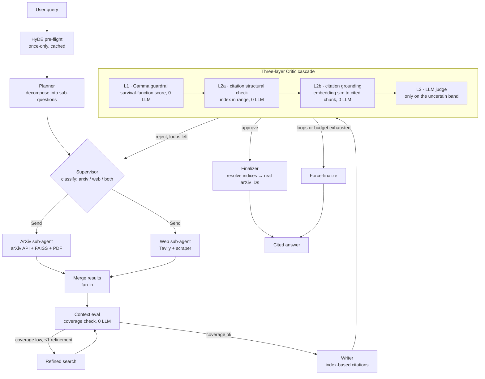

# Multi-Agent Research Assistant


A self-correcting multi-agent research system: parallel arXiv + web
retrieval, a cited synthesis draft, and a three-layer verification cascade
that keeps LLM cost bounded by construction (hard cap: 15 calls, ~$0.016
per query worst case).

Built end-to-end with `gpt-4o-mini` as the only API LLM — no managed vector
DB, no framework black boxes.

> **Author:** Yuezhou Zhao


*A real query end-to-end: the Critic rejects once, the loop restarts from
retrieval, and the revised draft is approved — 🚩 marks sentences the
guardrail flagged, and the `[N]` citations arrive resolved to real arXiv IDs.*

<details>
<summary>Screenshots: approved answer + live metrics panel</summary>


</details>

## Headline results

| | |
|---|---|
| **58.3%** of sentence verdicts resolved with **zero LLM calls** (cheap-first cascade; judge runs on the rest) | **F1 0.50 → 0.562** hallucination detection vs. guardrail alone (oracle-judge ceiling: 0.600) |
| **Router distilled to a local 1.5B model**: 0.446 → 0.838 route accuracy (−1.6 pt vs. the gpt-4o-mini teacher) at ~3× lower mean / ~5× lower p95 latency | **≤ 15 LLM calls per query, enforced** — worst-case ~$0.016/query; degraded answers are flagged, never silently truncated |

Full tables, methodology, and the negative results: **[docs/results.md](docs/results.md)**.

## Architecture


<details>
<summary>Text version of the flow (mermaid)</summary>



</details>

**Two tiers, stated precisely:**

- **Retrieval tier — multi-agent.** The arXiv and web sub-agents own
  disjoint tool sets, run concurrently via LangGraph's `Send` API, and
  write to non-overlapping state slices; results merge only at a fan-in
  node. (Concurrency is async within one process — the independence is
  about tools and state, not distributed infrastructure.)
- **Synthesis tier — multi-role state machine.** Planner, Writer, and
  Critic share one state on purpose: their data dependencies are tight,
  and separate agents would add serialization overhead for no benefit.

**Retrieval** is two-stage: BM25 + FAISS ranked independently, fused with
reciprocal-rank fusion, then re-scored by a cross-encoder reranker over
parent-child chunks (128-token children for recall, 512-token parents for
context — hand-written, ~50 lines). BGE-reranker-v2-m3 was the original
reranker; it measured over the 500 ms/query latency budget on real chunks,
so the shipped default is `ms-marco-MiniLM-L-6-v2` (BGE stays available
via a constructor arg).

## The verification cascade

Every draft sentence is scored cheapest-first; only genuinely uncertain
sentences reach an LLM:

1. **L1 — Gamma guardrail** ([`evaluation/gamma_guardrail.py`](evaluation/gamma_guardrail.py)):
   a calibrated embedding-distance survival-function score, ~2 ms, zero
   LLM. Resolves the confident approve/reject bands outright.
2. **L2a — citation structural check** ([`evaluation/citation_check.py`](evaluation/citation_check.py)):
   the Writer cites by *index* `[1..N]` and the Finalizer resolves indices
   to real arXiv IDs afterward — a fabricated identifier is impossible by
   construction.
3. **L2b — citation grounding** ([`evaluation/citation_grounding.py`](evaluation/citation_grounding.py)):
   `cosine(sentence, cited chunks)` catches citations that point at a real
   but *wrong* paper — a failure mode found by hand-labeling 65 sentences
   (36 were misattributed). Precision 0.89 / recall 0.62 against those
   labels, zero LLM.
4. **L3 — LLM judge**: runs only on the unresolved band, only while the
   budget allows.

Loop control is bounded on three axes: outer circuit breaker (max 3
rollbacks) + inner refinement (max 1) + global LLM budget (max 15 calls).
One design decision worth reading: the grounding threshold that maximized
F1 (0.82) made the correction loop non-convergent in live runs, so the
shipped value is 0.70 — the sweep and the reasoning are in
[docs/results.md](docs/results.md#choosing-the-grounding-threshold).

## Local-inference extension: distilling the router

The Supervisor's per-query routing call (arXiv / web / both) was distilled
from gpt-4o-mini into a local **Qwen2.5-1.5B + LoRA**, evaluated on a
130-row human-corrected held-out set:

| Metric | gpt-4o-mini (API) | Qwen2.5-1.5B zero-shot | + LoRA (local) |
|---|---:|---:|---:|
| route accuracy | 0.854 | 0.446 | **0.838** |
| latency p95 | 5.90 s | 0.58 s | **1.15 s** |

The zero-shot control shows the fine-tuning did the work (+39.2 points).
The wins are latency and on-device independence — the dollar saving at
this call volume is negligible, and the student inherits the teacher's
weakness on the `both` class. Full write-up:
[`experiments/lora_supervisor/RESULTS.md`](experiments/lora_supervisor/RESULTS.md).

## Setup & run

Prerequisites: Python 3.11, API keys in `.env` (copy
[`.env.example`](.env.example)): `OPENAI_API_KEY`, `TAVILY_API_KEY`.

### Local

```bash
python3.11 -m venv venv && source venv/bin/activate
pip install -r requirements.txt -c requirements.lock

python -m rag.indexer            # build the FAISS index (one-time, ~90s)
python -m scripts.smoke_test     # end-to-end sanity check → [smoke] OK

chainlit run frontend/app.py     # UI on :8000
uvicorn backend.main:app --port 8001   # optional: headless JSON API
```

The UI streams the live execution trace (including rollback iterations),
sidebar toggles for HyDE / `sf_threshold` (snapshotted per job), red-flag
highlighting of guardrail-rejected sentences, and a live metrics panel.

The FastAPI service exposes the same pipeline headlessly:

```bash
curl -X POST localhost:8001/research -H 'content-type: application/json' \
     -d '{"query": "How does chain-of-thought prompting work?"}'
# → {"job_id": "..."}   then poll /status/{id} and /result/{id}
```

### Docker

```bash
docker compose build
docker compose up        # UI on :8000, API on :8001; index auto-builds on first run

# Verify the container end-to-end (not just that it built):
docker compose run --rm --entrypoint python research-agent -m scripts.smoke_test
```

The image builds `linux/arm64` natively. For slow networks there are
BuildKit cache mounts and a PyPI mirror override
(`--build-arg PIP_INDEX_URL=...`).

For a public deployment, [`deploy/`](deploy/) adds a Caddy reverse proxy
with automatic TLS and basic-auth in front of both ports.

## Testing

```bash
pytest -q     # 104 tests: 99 run keyless; 5 live-LLM tests auto-skip without a key
```

CI runs the keyless suite on every push
([`.github/workflows/ci.yml`](.github/workflows/ci.yml)). Coverage focuses
on what's easy to get subtly wrong: circuit-breaker/budget routing,
parent-child chunk round-tripping, cascade routing, citation index
mechanics, the L2b grounding check (including a real-encoder test
reproducing an actual misattribution), and an AST-based lock asserting the
backend never imports the UI framework.

## Project structure

```
backend/
  state.py          shared state schema + per-job config snapshot
  graph.py          LangGraph state machine + Send fan-out routing
  main.py           FastAPI job API (POST /research, GET /status, /result)
  nodes/            preflight, planner, supervisor, arxiv/web agents,
                    context_eval, writer, critic, finalizer
rag/                parent-child chunker, two-stage retriever, indexer, tools
evaluation/         guardrail (L1), citation check (L2a), grounding (L2b)
frontend/app.py     Chainlit UI
experiments/        HyDE A/B, cascade effectiveness, threshold validation
  lora_supervisor/  router distillation (data prep, train, eval)
scripts/            smoke test, demo dry-run harness
deploy/             Caddy + production compose overlay
tests/              104 unit + integration tests
docs/results.md     full evaluation write-up
```

## Known limitations

- **Semantic Illusion.** Embedding-based checks (L1, L2b) can't flag
  hallucinations that sit close to correct answers in embedding space —
  including same-subfield citation misattributions. Catching those needs
  NLI or an LLM judge (planned next step).
- **HyDE showed no measurable retrieval win** at n=10 (the aggregate
  improvement traces to a single query). It stays on because it's cheap
  and harmless; rerunning at n=50 is the planned check.
- **Static index** — new papers require a re-index.
- **Single-user demo** — in-memory job store; concurrent multi-user load
  is out of scope.

Details and follow-up experiments for each: [docs/results.md](docs/results.md).
